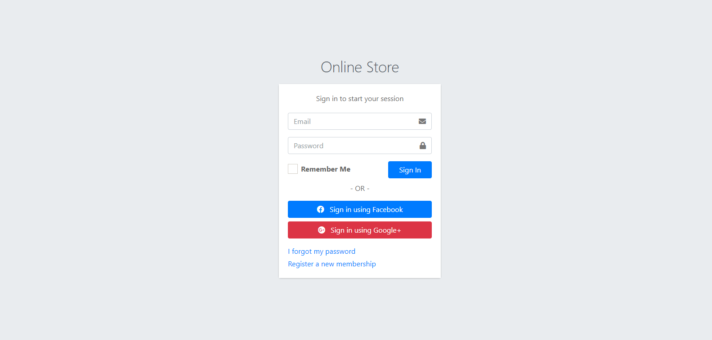
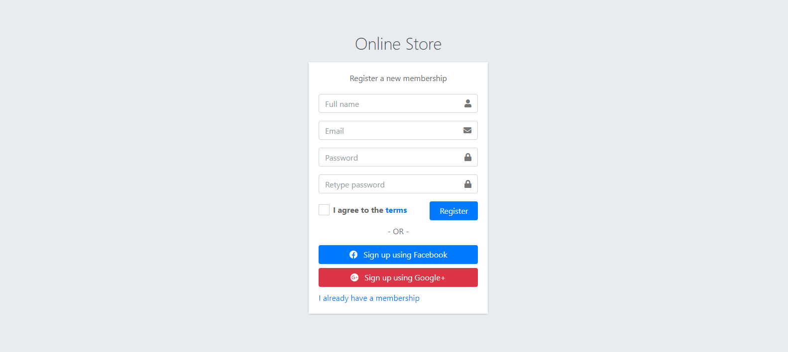
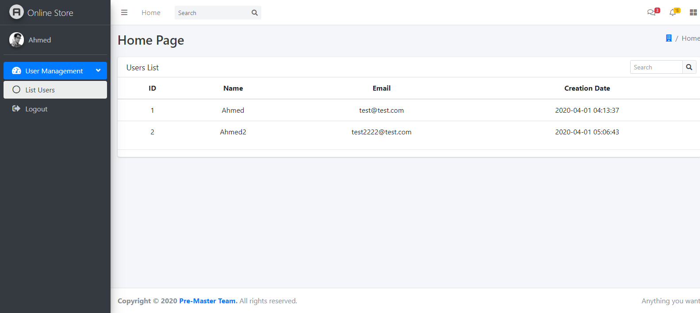

# Online Store Project

----------

## Instalation

1. Download WampServer from here [https://sourceforge.net/projects/wampserver/](https://sourceforge.net/projects/wampserver/ "wampserver")
2. Download composer from here [https://getcomposer.org/](https://getcomposer.org/ "composer")
3. Run ` git clone https://github.com/engahmed99/pre_masters-sw2-online-store-platform.git `
4. Import Database from **Docs/pre\_master\_store.sql** file
5. Run `composer install`
6. Run `php artisan serve`

## Hints

- You can change the application configuration from the .env file

- Use the postman file in **Docs/SW2 - pre master.postman_collection.json** file to test the web services

## Suggested interface

